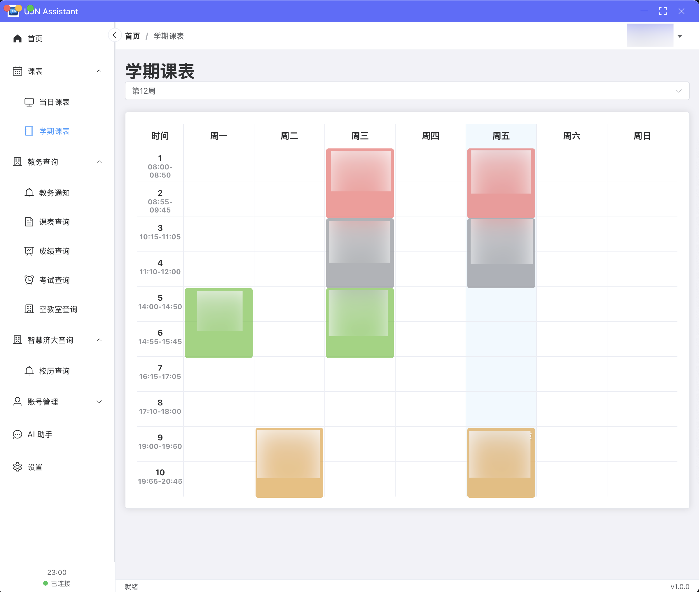

<div align="center">

</a>

# UJN Assistant

✨ 济南大学-智慧济大+教务系统+AI智慧APP ✨
</div>

## 介绍
UJN Assistant 是一款专为济南大学学生开发的桌面应用程序，旨在提供更便捷的校园信息查询和管理体验。通过整合教务系统和智慧济大平台的功能，学生可以在一个统一的界面中轻松获取和管理学习相关信息。

## 特性
- 基于 Electron 的跨平台桌面应用
- 使用 Vue 3 和 TypeScript 开发
- 支持多种功能模块
- 友好的用户界面
- 内置更新机制
- 支持多种平台（Windows、macOS、Linux）
- 支持多种主题（深色、浅色）
- 支持多种插件（如 Markdown 编辑器、代码高亮等）
- 支持多种数据格式（如 JSON、XML、CSV 等）

## 功能简介
- ### 教务查询
  - [x] 教务通知
  - [x] 课表查询
  - [x] 成绩查询
  - [x] 考试查询
  - [x] 空教室查询

- ### 智慧济大查询
  - [x] 校历查询

- ### 课表
  - [x] 当日课表
  - [x] 学期课表

- ### AI助手
  - [x] 模型自定义
  - [x] 语音自定义
  - [x] 语音输入
  - [x] 语音朗读
  - [x] AI对话

<div>

## 功能实现

### 主页✨

</a>

### 当日课表✨

</a>

### 学期课表✨

</a>

### 教务通知✨

</a>

### 课表查询✨

</a>

### 成绩查询✨

</a>

### 考试查询✨

</a>

### 空教室查询✨

</a>

### 校历查询✨

</a>

### AI助手✨

</a>
</a>
</a>
### 教务登录✨

</a>

### 智慧济大登录✨

</a>

### 设置✨

</a>
</a>

</div>

## 项目初始化

```sh
npm install
```

### 编译和运行调试模式

```sh
npm run electron:dev
```

### 构建命令

```sh
nnpm run electron:build
```
